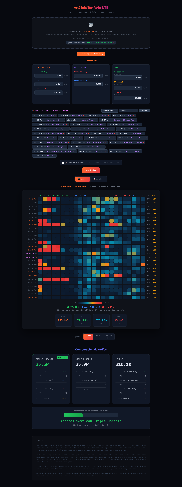

# UTE Visualizer

**Analyze your UTE electricity consumption and find the cheapest tariff plan — instantly, in your browser.**

Upload the hourly CSV you download from UTE's portal and get a full breakdown: an interactive heatmap, cost comparisons across all three residential plans, and charts that show exactly where your money goes.



---

## Features

- **Hourly heatmap** — every day × 24 hours, color-coded by consumption intensity with peak/off-peak bands highlighted
- **Three-tariff comparison** — Triple Horario, Doble Horario, and Simple, side by side
- **Configurable peak window** — choose your contracted peak slot (17–20 h, 18–21 h, or 19–22 h); the app automatically highlights which one saves you the most
- **EV simulation** — strips ~6.5 kWh from high-consumption hours to estimate your bill without an electric vehicle
- **Charts tab**
  - Average hourly load curve
  - Consumption profile by day of week
  - Cumulative cost over time (all three plans)
  - Rolling 7-day average
  - Monthly consumption comparison (when data spans ≥ 2 months)
- **Editable tariff rates** — override any $/kWh value if UTE updates prices or you want to run a scenario
- **Custom holidays** — mark feriados so peak-hour logic applies correctly
- **Multi-file support** — drop multiple CSVs (e.g. one per year) and they merge automatically
- **Zero backend** — 100% client-side; your data never leaves your device

---

## Tech stack


---

## Getting your UTE data

1. Log in at [mi.ute.com.uy](https://mi.ute.com.uy)
2. In the left sidebar, click **Mis Servicios**
3. From the options panel, select **Curva de Consumo Potencia Máxima**
4. Choose your date range and set the period to **1 hora** — this is the format the app requires
5. Click **Descargar** to download the CSV
6. Drop the file into UTE Visualizer

> You can export multiple CSVs (e.g. one per year) and load them all at once — the app merges them automatically.

---

## Getting started

```bash
git clone https://github.com/francocorreasosa/ute-visualizer.git
cd ute-visualizer
pnpm install
pnpm dev
```

Open [http://localhost:3000](http://localhost:3000).

### Build for production

```bash
pnpm build
pnpm start
```

---

## Tariff plans explained

| Plan | How it works |
|---|---|
| **Triple Horario** | Three hourly rates: Valle (00–06), Llano (rest of weekday), Punta (4-hour peak window). Weekends/holidays: no Punta. |
| **Doble Horario** | Two hourly rates: Punta (same 4-hour window) and Fuera de Punta (everything else). |
| **Simple** | No time-of-use differentiation. Monthly consumption splits into three progressive escalones: 1–100 kWh, 101–600 kWh, 601+ kWh, each at a higher marginal rate. |

All default rates include IVA (22%) and reflect UTE's 2025–2026 published tariffs.

---

## License

MIT
